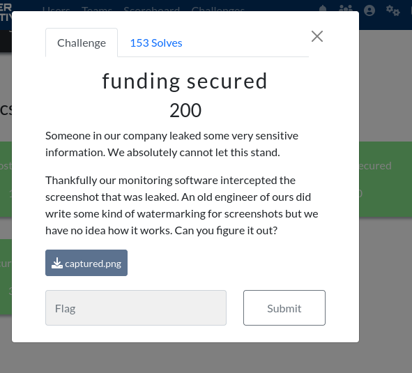

# Funding Secured


if you don't have zsteg installed:
gem install zsteg

``` zsteg captured.png ```
notice one of the outputs has .txt in it:
```
"b1,rgb,lsb,xy       .. text: "creator.txtUT\r"
```
use that as the parameter to extract and save output to a file:

``` bash
zsteg -E b1,rgb,lsb,xy captured.png >> file
```
since it gives data as an output, binwalk the txt files out:
```bash
binwalk --dd='.txt' file
```

```bash
cd _file.extracted
```
unzip 6FA2 (or whatever the zip is called on yours, i think it should be the same)
```
cat flag.txt
```
# flag{what_came_first_the_stego_or_the_watermark}