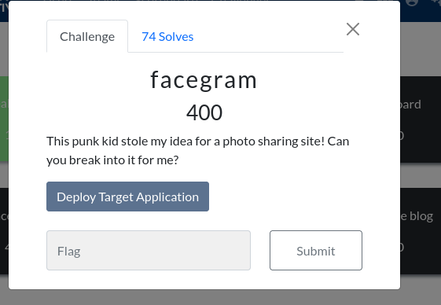

## Facegram



Challenge text: This punk kid stole my idea for a photo sharing site! Can you break into it for me?

Solve:

- Tossed `https://thecybercoopctf-58bcc5208ff2-facegram-0.chals.io/view.php?id=30`  to sqlmap and got some info back including the user database.

```
| id | name     | admin | email                  | password                                                         |
+----+----------+-------+------------------------+------------------------------------------------------------------+
| 1  | admin    | 1     | admin@facegram.fake    | 8e379021aeca6eb727f33201b961e8b4441961ede9be82fe050ee0fb8d86093b |
| 2  | onlycats | 0     | onlycats@facegram.fake | 43e80f0d8bb972421ff400fa9b2c78b1df9da696719c029ffcb579fac865f838 |
| 3  | onlydogs | 0     | onlydogs@facegram.fake | 2c7ebb1015e3ae7a19710cc10d7afe08e1b44d5531d5b86233ee26580777360c |
```

- Cracked each hash except admin, onlycats:onlycats, onlydogs:elephants123
- Registered a new account with the username test
- Explored the forgot password system and sent myself a reset request
- Received a small token, requested a second token to see if this could be bruted but the second token matched the first one


- Identified that the token was the username in hex
- Sent a request for the admin account and reset the password by navigating to `http://thecybercoopctf-58bcc5208ff2-facegram-0.chals.io/forgot-password.php?token=646D696E`
- Logged into the admin account and gained access to a new admin area with a bulk .zip uploader


- Reviewed ways to bypass countermeasures for upload attacks and discovered the zip slip being discussed on `https://exploit-notes.hdks.org/exploit/web/security-risk/file-upload-attack/`


- Crafted the archive in the exact way mentioned in the screenshot and uploaded the archive.
- The attack seemed to work as the shell was now accessible from the web root instead of the uploads folder
- Explored the filesystem and discovered the flag


